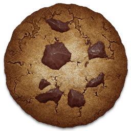

# Cookie Clicker - TCO NCA



## 🍪 À propos du projet

Ce projet est un **Cookie Clicker** complet développé en JavaScript (Node.js/Express) dans le cadre d'un TP fil rouge. L'objectif est de créer un jeu interactif tout en appliquant des pratiques de développement professionnelles : tests automatisés, intégration continue (CI/CD) et méthodologie TDD.

## 🚀 Fonctionnalités

- **Gameplay de base** : Cliquez sur le cookie, accumulez des points et voyez votre score grimper !
- **Production passive** : Achetez des améliorations (Curseurs, Grands-mères, Fermes...) pour générer des cookies automatiquement.
- **Système de sauvegarde** : Votre progression est persistée localement.
- **Interface Responsive** : Jouez sur ordinateur ou sur mobile.
- **Tests robustes** : Couverture de tests élevée avec Vitest (Unitaires) et Playwright (E2E).

## 🛠️ Installation

### Prérequis

- [Node.js](https://nodejs.org/) (version 18 ou supérieure recommandée)
- [npm](https://www.npmjs.com/)

### Étapes

1. Clonez le dépôt :
   ```bash
   git clone https://github.com/Thomas-co1/Thomas-co1-cookie-clicker-TCO-NCA.git
   cd Thomas-co1-cookie-clicker-TCO-NCA
   ```

2. Installez les dépendances :
   ```bash
   npm install
   ```

3. Configurez l'environnement :
   Copiez le fichier `.env.example` (si disponible) en `.env` et ajustez les variables.

4. Lancez l'application :
   ```bash
   npm run start
   ```
   L'application sera accessible sur `http://localhost:3000`.

## 🧪 Tests et Qualité

Le projet utilise **Vitest** pour les tests unitaires et **Playwright** pour les tests de bout en bout (E2E).

```bash
# Exécuter les tests unitaires
npm test

# Exécuter les tests avec couverture
npm run test:coverage

# Exécuter les tests E2E (Playwright)
npm run test:e2e

# Vérifier le style du code (Lint)
npm run lint
```

## 📂 Structure du Projet

```text
├── .github/workflows/   # Configurations CI/CD (GitHub Actions)
├── bin/                 # Scripts de démarrage
├── public/              # Assets statiques (JS, CSS, Images)
├── routes/              # Définition des routes Express
├── tests/               # Tests unitaires et E2E
├── views/               # Templates EJS
├── app.js               # Point d'entrée de l'application
├── db.js                # Configuration de la base de données
└── PROJECT.md           # Documentation détaillée du projet
```

## 📜 Documentation complémentaire

- [PROJECT.md](PROJECT.md) : Vision globale et architecture technique.
- [GUIDELINES.md](GUIDELINES.md) : Conventions de code et workflow de développement.
- [TDD.md](TDD.md) : Scénarios de tests détaillés.

---
*Réalisé dans un cadre pédagogique.*
